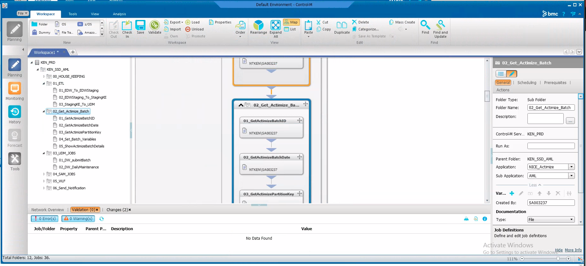
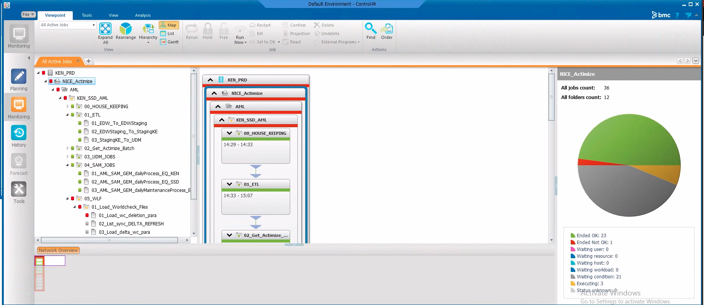
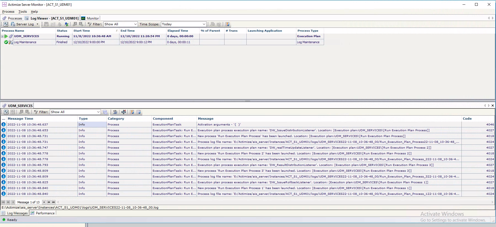

.. _deployment-setup:

===============================
Production Setup and Deployment
===============================

This guide summarizes, at high level, the architecture of the ETL process and by extension the components, resources and assets that work together to ensure the ETL process functions seamlessly. 

.. note::

    * The ETL is a key component to ensure the NICE Actimize AML system generates the relevant alerts
    * This document will not describe the other components of the NICE Actimize AML system
    * This document will not describe the system architecture as that is provided by NICE Actimize
    
***************
Sources of Data
***************

Data is extracted from the following sources:

* **Oracle Entreprise Data Warehouse (EDW)** - Is the primary source of data for parties, accounts, loans, transactions etc
* **Currency exchange rate flat files** - Contains exchange rates on a daily basis
* **Worldcheck delta and deletion lists** - Contains the Worldcheck files
* **Employee repository** - Contains bio data and organizational data for employees

*****************
ETL Process Steps
*****************

The ETL process includes the following stages, that must be performed in a sequential manner

* Step 1. Extraction of data from sources and loading of raw data onto **EDW_Staging** SQL Server database
* Step 2. Transform the raw data in **EDW_Staging** and load it into **StagingKE** SQL Server database
* Step 3. Load the transformed data stored in **StagingKE** onto **UDM_STG** SQL Server database 

********************
ETL Deployment Model
********************

The ETL process is mainly handled by SSIS scripts and .bat files. The deployment model will comprise deployment of 3 major components. They are:
   
   #. SSIS scripts
   #. Batch scripts
   #. NICE Actimize scripts scheduling via Control-M.

The deployment via Control-M is beyond the scope of this document but there will be high level detail of how the scripts are currently deployed.

1. Deploy SSIS Scripts
======================

* Deploy SSIS scripts onto an instance of SQL Server. This allows the SSIS scripts to be executed in 3 ways, viz, manually run directly, run via a SQL job or run using `dtexec utility <https://learn.microsoft.com/en-us/sql/integration-services/packages/dtexec-utility?view=sql-server-ver16>`_. See :ref:`Schedule Package <schedule-package>`:
* Two SQL Agent jobs should be defined:

   #. **Load Currency Exchange Rates and Worldcheck Files Job** 

      This job should run **WorldCheckCurrencyExchangeRateInitiation.dtsx** and should be scheduled to run at 9am every day. This is about 2 hours before the main ETL scripts start running.

   #. **Main ETL job**

      Job to perform **ETL** process. However, this job should be disabled and should only be used in instances where the Control-M is not in use. This is because Control-M jobs already call the SSIS scripts to perform the ETL. Define 3 steps to execute the following scripts sequentially:
   
         *  *ETL_00_ExtractEDWToCSV.dtsx*
         *  *ETL_00_Initiation_V2.dtsx*
         *  *UDM_00_Initiation_v2.dtsx*

2. Deploy batch scripts
=======================

* Copy the .bat files onto a directory located in the SQL server host. This is the server specified in the above step. Take note of the directory path because you will need to update it as part of the SSIS execution parameters. See :ref:`execute-package` for details on how to modify SSIS script parameters. The preferred way is to copy the entire project folder

3. Deploy NICE Actimize scripts
===============================

Refer to `Control-M website <https://www.bmc.com/it-solutions/control-m.html>`_ for more details on how Control-M operates and its design around nodes, agents, EM-Client and EM-server. Refer to `Control-M User guide <https://www.doc-developpement-durable.org/file/Projets-informatiques/cours-&-manuels-informatiques/control-m/CONTROL-M%20User%20Guide.pdf>`_

* There are 2 servers that host the scripts 
   
   * **WLF server**. Hosts scripts to run WLF related jobs and a Control-M agent is installed here to run the WLF scripts
   * **SAM/UDM server**. Hosts scripts to run UDM and SAM related jobs. A Control-M agent is also installed here to run the SAM/UDM scripts

* The job definition in Control-M is as shown below

Important Control-M script deployment steps
-------------------------------------------

.. note::
   
    * Create a **Run-as** from the Control-M Configuration Manager. The Run-as should have the credentials of the Service Account that will be used to run/execute the scripts

      * Logon-as-batch privilege
    
         .. image:: _static/images/control_m_runas.png
            :width: 800
            :alt: Control-M run-as

    * Allow running Control-m as user. See `Control-M RunAS <https://www.youtube.com/watch?v=Q7hiFsAe2Bo>`_
    * Create 2 Host groups and link each host group to the node where the agents are installed
    * Set Control-m client to run as the Service Account
    * Grant **Log on as batch job** privilege to the service account specified when creating a **Run-as** entry

      * Logon-as-batch privilege
    
         .. image:: _static/images/logon_as_batch.png
            :width: 800
            :alt: Logon-as batch

    * Ensure UDM_00_WorldCheckInitiation.dtsx is scheduled in SQL Agent to run at least 1 hour before the jobs start to run. The server hosting the Worldcheck files had access denied issue when attempt to access the Worldcheck files from within Control-m. However, the access denied issue is not faced when the same is run using an SQL Agent. So as a workaround, we schedule **WorldCheckCurrencyExchangeRateInitiation.dtsx** to run before the main ETL scripts. This way, we will run the other ETL jobs from within Control-M

      
Monitoring Control-M batch jobs
--------------------------------

You can monitor job execution in two ways:

* Log into the server where Control-M client has been installed

* Log into Actimize Server monitor which is installed in each of the WLF and SAM/UDM Server. The monitor provides a visual way of monitoring NICE Actimize jobs.  See below

