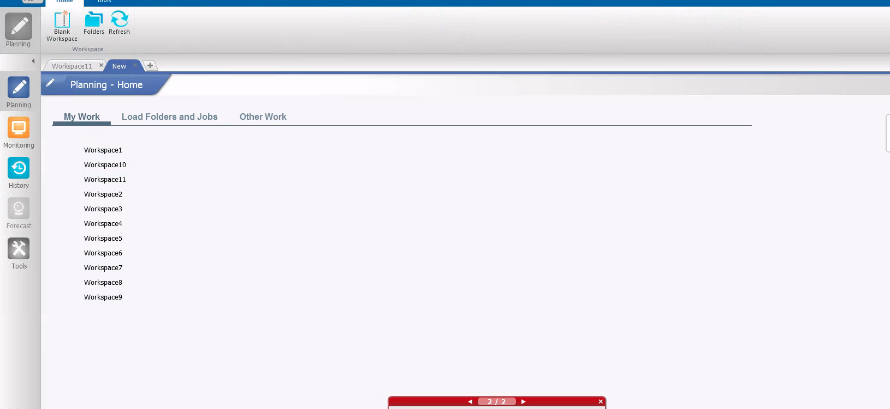
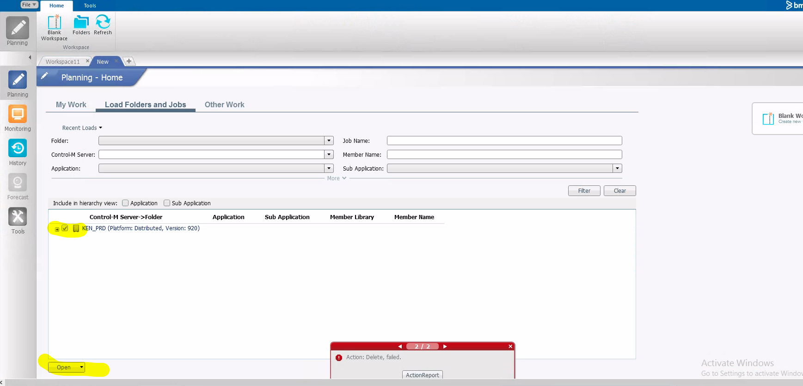
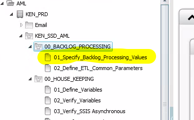
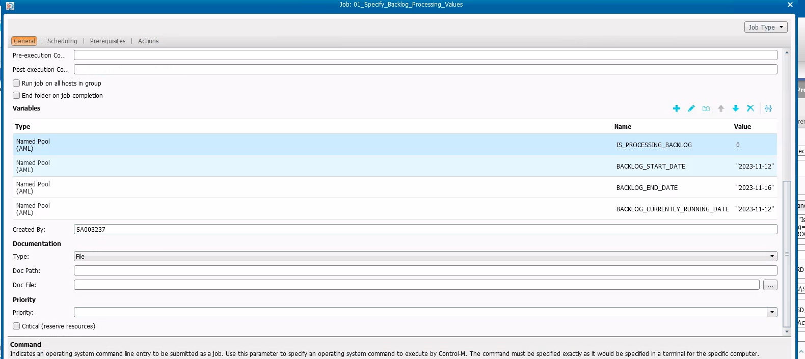
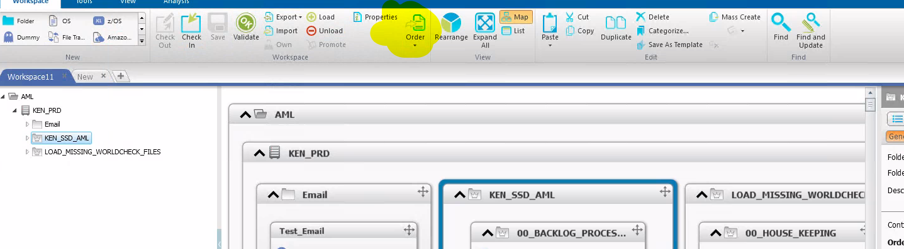

=======================
How to process backlogs
=======================

.. note::

The assumption here is that for each skipped day, a separate batch is run.

There are 4 important variables that you need to be aware

#. **IS_PROCESSING_BACKLOG**:- A value of 1 specifies that we are in a backlog state. A value of 0 specifies we are in normal running mode
#. **BACKLOG_START_DATE**:- This is the start of the backlog period. Format is YYYY-MM-DD
#. **BACKLOG_END_DATE**:- This is the end of the backlog period. Format is YYYY-MM-DD
#. **BACKLOG_CURRENTLY_RUNNING_DATE**:- Date for whose batch we are currently processing. Format is YYYY-MM-DD

- **NB**. The ETL will derive balances using the transactions to date going backward into the backlog dates

Steps
=====
1. Ensure worldcheck daily delta and delete files are loaded (copied onto the respective folders) for each of the days included in the backlog. In most times, these files will be already loaded since this is done by a separate SQL Agent job. The ETL also attempts to load the respective files in case the SQL Agent job did not succeed. It is always good to confirm that these files exist

* Log into Control-M and navigate to Planning tab

* Open workspaces by going to **Load Folders and Jobs** tab. Select **KEN_PRD** folder then click on **Open** button at the bottom

* Specify backlog dates from within the Control-M environment. 

2. Double click on **01_Specify_Backlog_Processing_Values** node

3. Specify the values for **BACKLOG_START_DATE**, **BACKLOG_END_DATE** and **BACKLOG_CURRENTLY_RUNNING_DATE**. The date format is **YYYY-MM-DD**

* Order the folder and start the execution making sure to modify the **BACKLOG_CURRENTLY_RUNNING_DATE** variable for the day you are processing backlog

Key points to note
==================

#. While in backlog processing period, disable daily scheduling of jobs by specifying order method to **None (Manual Order)**
#. When you are done processing backlog, enable daily scheduling of jobs by specifying order method to **Automatic (Daily)**
#. Ensure the ETL process begins within such a time when synchronization into EDW has completed. This is to avoid loading incomplete data
#. Ensure to process backlogs days sequentially a day after the other
#. When you are done processing the backlog set the value of **IS_PROCESSING_BACKLOG** variable to **0**, otherwise it will still behaving like it is in a backlog state
